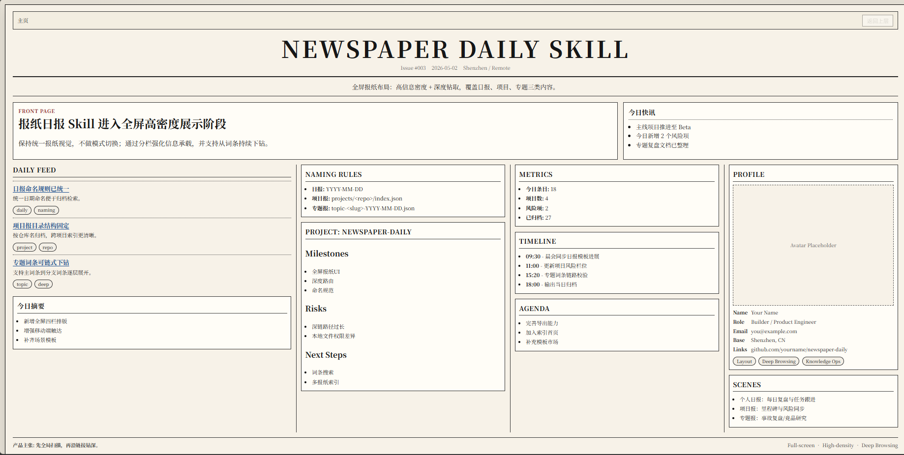

# newspaper-daily-skill

<div align="right">
  <a href="README.md">English</a> | <a href="README_zh.md">简体中文</a>
</div>

A Claude skill for generating newspaper-style pages with deep browsing.

It helps turn project updates, daily notes, and topic reports into a full-screen newspaper layout with chained entry navigation.

## Demo



## What this skill provides

- Newspaper-style HTML template
- Deep browsing via `#/entry/<id>`
- Chained internal links and breadcrumb-style navigation
- Reusable JSON schema for daily, project, and topic papers
- Mobile-friendly single-column fallback
- Print-to-PDF friendly output

## Repository structure

- `SKILL.md` - skill metadata and usage instructions
- `assets/template/index.html` - full-screen newspaper template
- `assets/template/examples/mvp.json` - sample data with deep-link entries

## Naming rules

- Daily paper: `YYYY-MM-DD.json` and `YYYY-MM-DD.html`
- Project paper: `projects/<repo-or-folder-name>/index.json`
- Topic paper: `topic-<slug>-YYYY-MM-DD.json`
- Entry ID: `<domain>-<slug>`

## Data fields (core)

- `feed[].entryId` links homepage items to entries
- `entries[]` stores deep-browsing content:
  - `id`
  - `title`
  - `content`
  - `links[]` (`targetId`, `label`)

## Typical use cases

1. Daily logs and team briefings
2. Project milestone and risk updates
3. Topic research and incident retrospectives
4. Knowledge hubs with drill-down navigation

## Reuse in another project

1. Copy `assets/template/index.html` to your target project root.
2. Copy `assets/template/examples/mvp.json` to `examples/` in your target project.
3. Replace JSON content while keeping the field schema.
4. Open `index.html` directly or run a static server.

Example static server:

```bash
python -m http.server 8000
```

Then open `http://localhost:8000`.

## License

Use according to your project policy. Add your preferred license file in this repository if needed.
